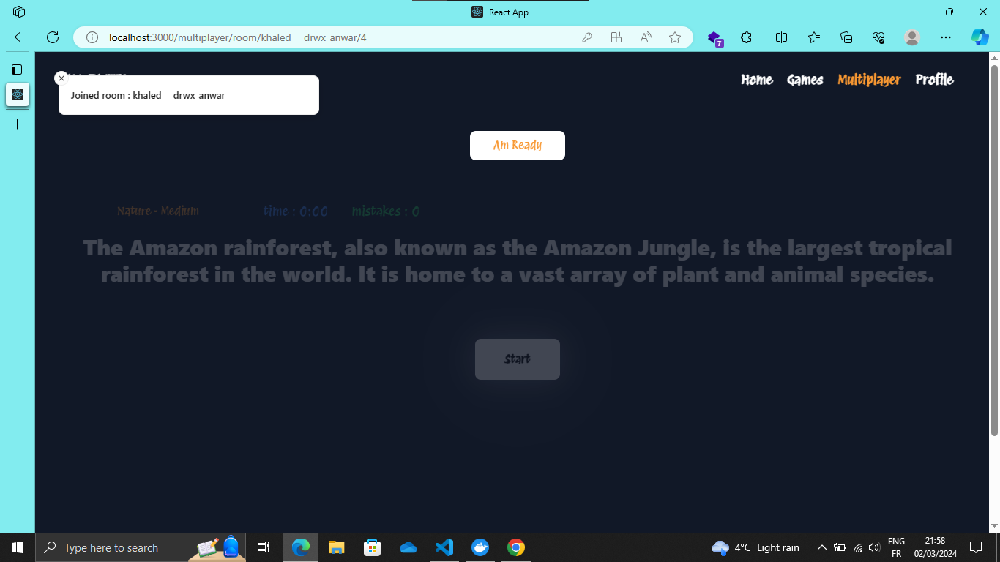
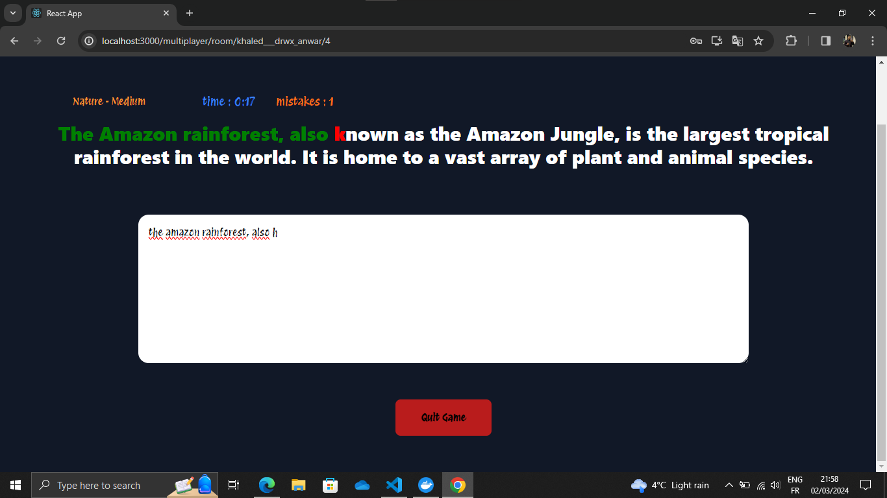

# Multiplayer Typing Game

This is a multiplayer typing game where multiple players can compete against each other in typing challenges. The game is built using Node.js, React, Express, Socket.IO, and PostgreSQL. The backend application is dockerized using Docker Compose, and the integration of the React app into the Dockerized environment is planned for a future update.

## Features

- Multiplayer typing game where players can compete against each other in typing challenges.
- Real-time updates using Socket.IO for seamless multiplayer experience.
- PostgreSQL database for storing game data and user information.
- Dockerized backend application for easy deployment and scaling.

## Technologies Used

- Node.js
- React
- Express
- Socket.IO
- PostgreSQL
- Docker
- Docker Compose

## Getting Started

To get started with the development or deployment of the multiplayer typing game, follow these steps:

1. Clone the repository:

   ```bash
   git clone <repository_url>
Navigate to the project directory:

bash
Copy code
cd multiplayer-typing-game
Install dependencies for both backend and frontend:

bash
Copy code
cd backend
npm install
cd ../frontend
npm install
Set up the PostgreSQL database:

Create a PostgreSQL database and configure the connection in the backend application.
Start the backend server:

bash
Copy code
cd ../backend
npm start
Start the frontend development server:

bash
Copy code
cd ../frontend
npm start
Access the application in your browser:

Open http://localhost:3000 to view the React app.

Docker Deployment
To deploy the multiplayer typing game using Docker Compose:

Build the Docker images:

bash
Copy code
docker-compose build
Start the Docker containers:

bash
Copy code
docker-compose up
Access the application in your browser:

Open http://localhost:3000 to view the React app.

## Screenshots






## Contributing
Contributions are welcome! Feel free to open a pull request or submit an issue for any feature requests, bug fixes, or suggestions.
